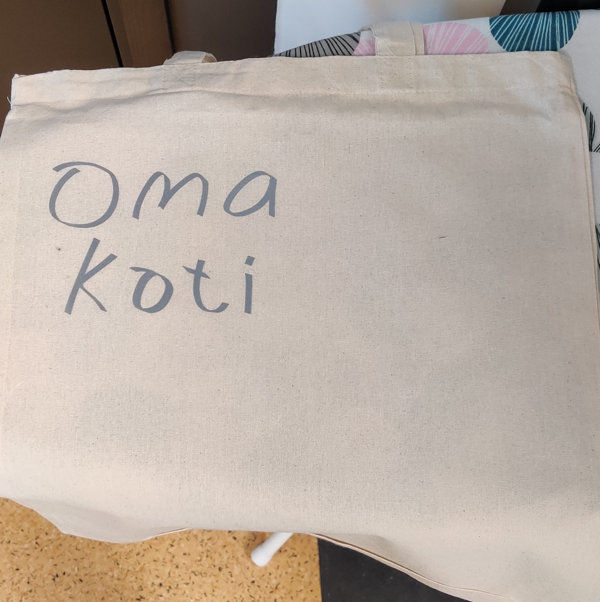
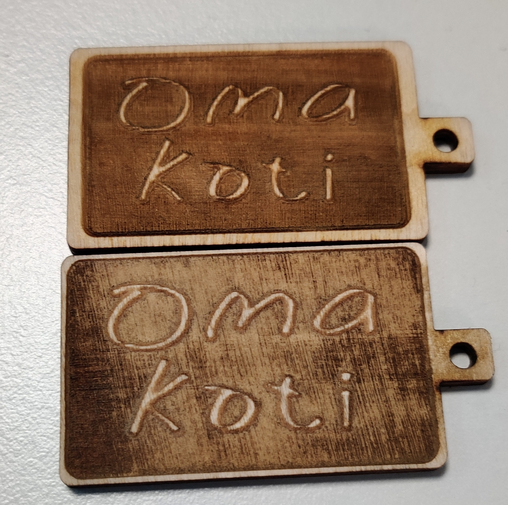
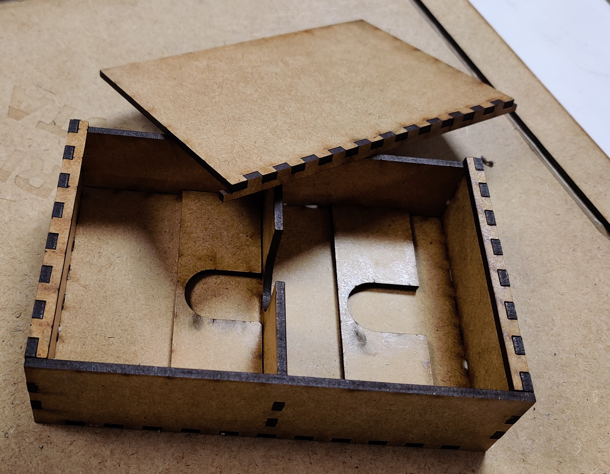

Showcase

Table of contents

<a href="MARKDOWN.md" id="h4" class="intend4"><b>Projects</b> <i>(MARKDOWN.md)</i> (link)</a>

 

Summary of experiences

 

    
Social aspect

Teaching as a peer and as a senior

Diginikkarit (Programming)

In Diginikkarit on-the-job experience I have helped my peers with the <a href="#moocfi-python-programming-2023">MOOC.fi Python Course (link)</a> by helping them to an extend depending on their difficulties. If they were at a wall, I guided them more. Usually by writing, drawing and writing pseudo code for them. Big part of what I looked at is thinking if they are handling problems in small enough pieces.

Rocket league <i>and other games</i> (Gaming)

In rocket league, I have been acting as a type of guru in a community where I had earned respect as a very talented player and teacher/coach. I have in total over 5000 hours in the game and I have played with top players, including games with pro players. I had learnt to understand and see the game in a more broad manner, in a more meta manner. In example of instead of thinking as one action and figuring how to do best in that, I instead looked at am I in good position in the first place. If your actions feel hard to do and you are proficient player/actor, usually it just means that you are having difficulties with the actions you take because of the situation you find yourself in. To improve in those situations you have to find a way to have better position to make the action less effortful.

 

Bounce Climber (Unity Game Project)

<a href="https://github.com/NicknameAlwaystaken/Bounce-Climber" class="intend2">Bounce-Climber (link)</a>
 

 

Blender (self made models)

 

Ice Platform with breakable ice (Self made in blender)

 

Grass Platform (Self made in blender)

 

Diginikkarit BusinessOulu (On-The-Job Experience and FabLab)

 

Programming

Courses

<a href="https://programming-23.mooc.fi/" id="h4" class="intend4">MOOC.fi Python Programming 2023 (link)</a>

In this course I have completed <b>Introduction to Programming</b> with 100% points. I started working on it 20.2.2023 and finished exercises by 14.3.2023. I had immediately started next course <b>Advanced Course in Programming</b> on the next day 14.3.2023.

<a href="https://sqltrainer.withmooc.fi/#1" id="h4" class="intend4">SQLTrainer MOOC.fi (link)</a>

In this trainer I have completed tasks from 1 to 71. I didn't pursue it further until I might need more practice.

<a href="https://www.elementsofai.com/fi" id="h4" class="intend4">Elements of Ai (link)</a>

I signed up for the course and started doing it slowly. Only done first part so far.

 

FabLab

3D-Printers

<a href="https://www.stlfinder.com/model/diablo-3-kanai-s-cube-2Vk35e8E/2603796/" id="h4" class="intend4">Kanai's cube (link)</a>

Kanai's cube (model found online)

    

Vinyl Cutter

Fabric Bag with Reflective Text

a Fabric Bag with Reflective Text

Laser Cutter

Keychain 2 versions (plywood self made on Inkscape)

Keychains self made model

<a href="https://festi.info/boxes.py/" id="h4" class="intend4">Boxes.py (plywood) (link)</a>

Default cardbox

Default starbox

